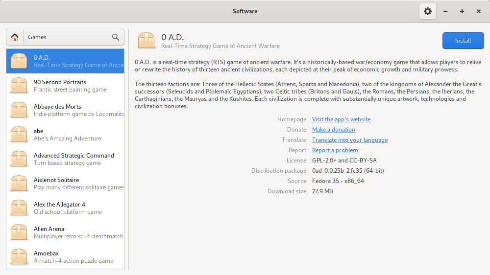

# Xings PackageKit

The **Xings-PackageKit** project is a set of clients for [PackageKit](https://www.freedesktop.org/software/PackageKit/), designed to
integrate with GTK desktops. Of course, in terms of design and integration, we
mean that we use this toolkit, hoping that it works on any desktop beyond Xfce
or Mate.

This is a fork of [gnome-packagekit](https://gitlab.gnome.org/GNOME/gnome-packagekit) version 3.14.3 that we consider is the last
one with proper integration with other desktops.

## Screenshots

## Acknowledgments

Many thanks to Richard Hughes and all subsequent maintainers of the entire
PackageKit ecocystem.
